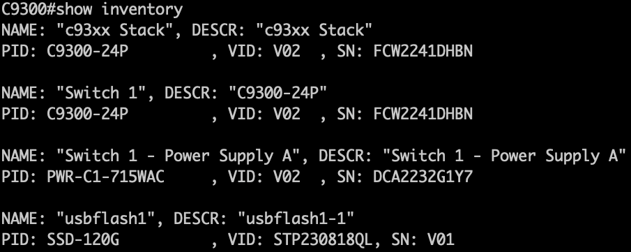
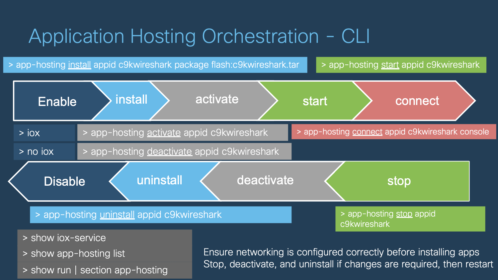
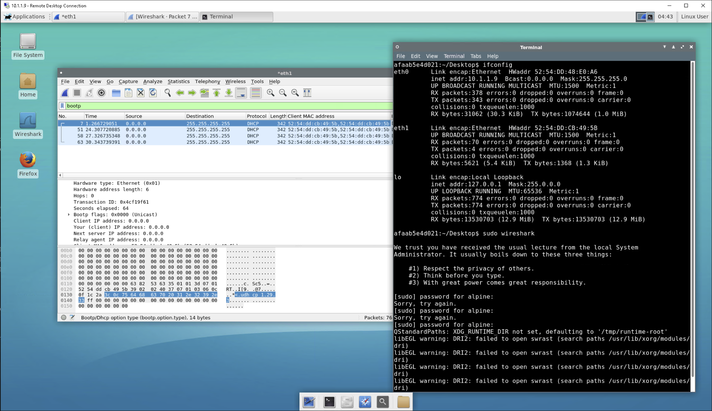

# c9k-wireshark
Cisco Catalyst 9300 running IOS XE 17.1.1 with Docker AppHosting, using Remote Desktop to run Wireshark

# 1. Prerequisites IOS XE 17.1.1 + SSD
	Cisco Catalyst 9300
	SSD-120G USB Storage
	IOS XE 17.1.1 Software
	DNA Advantage License
	
The show inventory command can be used to confirm the hardware and SSD:

The show version can be used to confirm the version:

	C9300#show version
	Cisco IOS XE Software, Version 17.01.01
	Cisco IOS Software [Amsterdam], Catalyst L3 Switch Software (CAT9K_IOSXE), Version 17.1.1, RELEASE SOFTWARE (fc3)
	Technical Support: http://www.cisco.com/techsupport
	Copyright (c) 1986-2019 by Cisco Systems, Inc.
	Compiled Fri 22-Nov-19 03:41 by mcpre

# 	2. The Docker Container

Get the Docker container

	$ docker run -d --shm-size 1g --name rdp -p 3389:3389 danielguerra/alpine-xfce4-xrdp

Once downloaded and running, verify RDP connection on port 3389, then package into .tar

	$ docker images 		- This lists all image ID’s available
	$ docker ps			- This lists all container ID’s that are running
	$ docker save –o c9kwireshark.tar <imageID> c9kwireshark

Copy the c9kwireshark.tar to the Catalyst 9300 USB flash over the network using copy command

	C9300# copy http://10.85.134.66/c9kwireshark.tar usbflash1:

# 	3. Configure Application Hosting Interface: Ap1/0/1

	interface AppGigabitEthernet1/0/1
	 description Uplink to AppH
	 switchport mode trunk
	end

# 	4. Configure Application Hosting App: c9kwireshark

	app-hosting appid c9kwireshark
	 app-vnic AppGigabitEthernet trunk
	  guest-interface 1
	   mirroring
	  vlan 101 guest-interface 0
	   guest-ipaddress 10.1.1.9 netmask 255.255.255.0
	 app-default-gateway 10.1.1.3 guest-interface 0
	 app-resource docker
	 app-resource profile custom
	  cpu 7400
	  memory 2048
	  persist-disk 1024
	  vcpu 2

 

# 	5. Start the Container

Ensure IOX is started, and that all AppHosting config is set prior

	app-hosting install appid c9kwireshark package usbflash1:/c9kwireshark.tar
	app-hosting activate appid c9kwireshark
	app-hosting start appid c9kwireshark

Stop the container, make any changes to the network interaces as needed before re-starting with above commands

	app-hosting stop appid c9kwireshark
	app-hosting deactivate appid c9kwireshark
	app-hosting uninstall appid c9kwireshark 

# 	6. Connect via RDP and run Wireshark

Opening a Remote Desktop session to 10.1.1.9, the Docker container on the Catalyst 9300 shows the XFCE desktop with Wireshark

The eth0, or “guest interface 0” has the IP address, while eth1, or “guest interface 1” is configured in mirroring mode as a trunk

